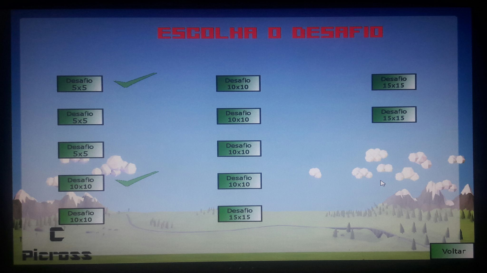
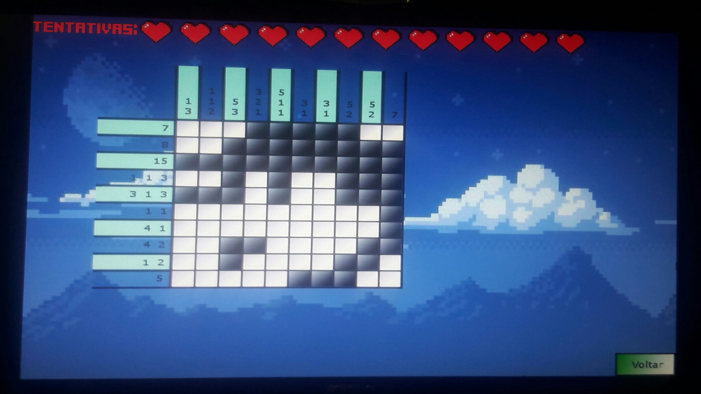
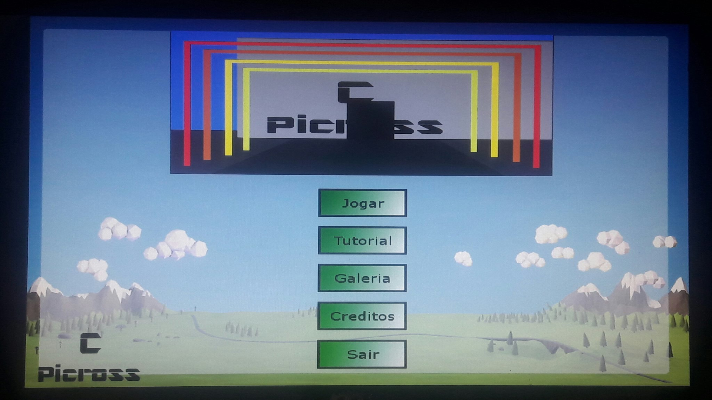
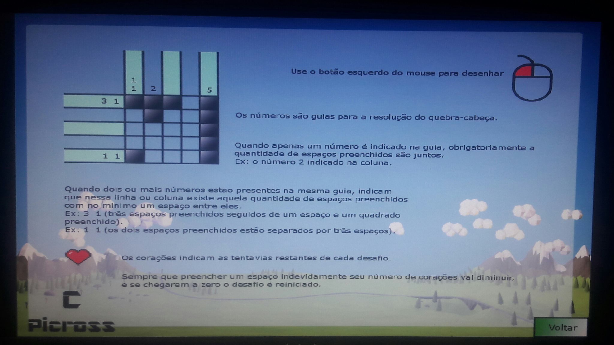
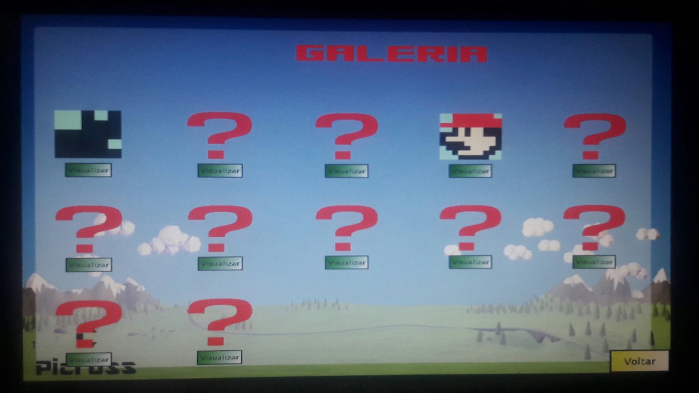

# FatecPicross

STATUS: Concluido

EQUIPE: Luis Carneiro (Programação e Design)
        Victor Lopes (Arte)

PLATAFORMA: PC

Jogo do gênero puzzle desenvolvido em C utilizando a bibloteca SDL.

